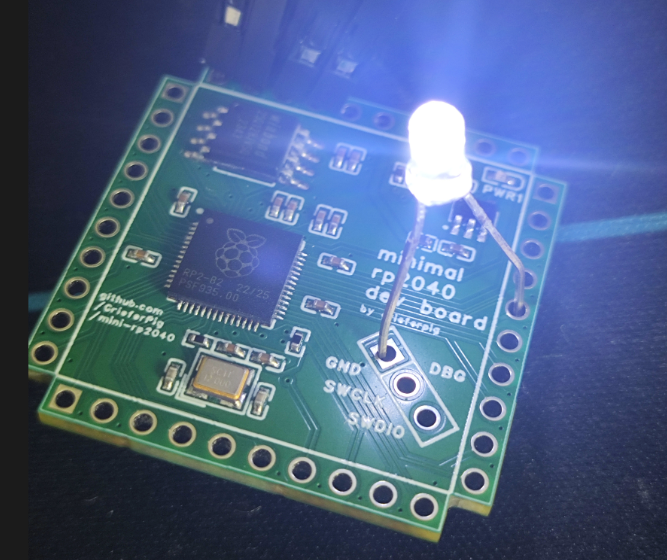

# mini-rp2040

minimalistic rp2040 dev board in a small form factor (30.7 x 30.7mm), good for embedding into other projects

> [!Important]
> This board is NOT production ready. It might cause interferences or straight up blow up your house. This is a hobbyist project. Use at your own risk.

## Features

- all gpios are exposed (0-29)
- have a VCC fuse that make sure it doesn't blow up the whole board
- onboard debugger pins to make your debug life easier (they are exposed thru edge connectors as well)
- too minimalistic (which means it's very flexible in design!)
- it looks kinda cool
- it is designed by me
- there are ponies printed on the back side so if you don't mind consider this board a pony merchandise

## Pinout

## Misc

